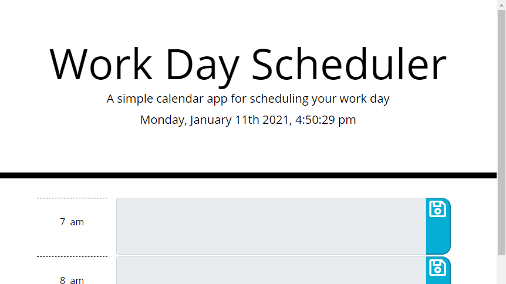

# Day-Planner

## Description

Application is intended to aid in planning the users day between the hours of 7am and 7pm. 

Gray textarea = hour has past

Red textarea = present hour

Green textarea = future hour

Within either the red or green textarea, the user can input whatever task they like. Clicking the save button will save the input and keep it upon refresh. Gray textareas are disabled. 

The user can return the next day and the inputs will be cleared to make room for new input for the new day.

Visit page [here](https://josecordova42.github.io/Day-Planner/).

## Usage

## Collaborators

[Jake Hendershott](https://github.com/jwhendershott)

## License

[License]()

MIT License

Copyright (c) 2021 Jose Cordova

Permission is hereby granted, free of charge, to any person obtaining a copy
of this software and associated documentation files (the "Software"), to deal
in the Software without restriction, including without limitation the rights
to use, copy, modify, merge, publish, distribute, sublicense, and/or sell
copies of the Software, and to permit persons to whom the Software is
furnished to do so, subject to the following conditions:

The above copyright notice and this permission notice shall be included in all
copies or substantial portions of the Software.

THE SOFTWARE IS PROVIDED "AS IS", WITHOUT WARRANTY OF ANY KIND, EXPRESS OR
IMPLIED, INCLUDING BUT NOT LIMITED TO THE WARRANTIES OF MERCHANTABILITY,
FITNESS FOR A PARTICULAR PURPOSE AND NONINFRINGEMENT. IN NO EVENT SHALL THE
AUTHORS OR COPYRIGHT HOLDERS BE LIABLE FOR ANY CLAIM, DAMAGES OR OTHER
LIABILITY, WHETHER IN AN ACTION OF CONTRACT, TORT OR OTHERWISE, ARISING FROM,
OUT OF OR IN CONNECTION WITH THE SOFTWARE OR THE USE OR OTHER DEALINGS IN THE
SOFTWARE.

